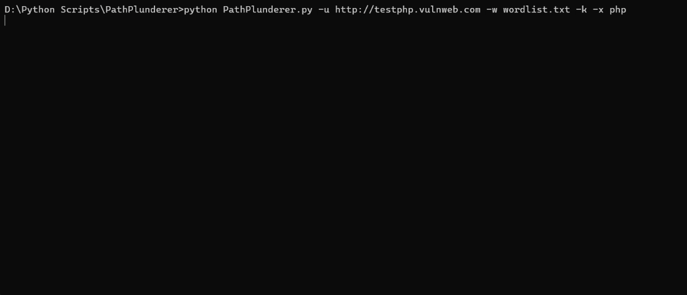

```
██████╗  █████╗ ████████╗██╗  ██╗    ██████╗ ██╗     ██╗   ██╗███╗   ██╗██████╗███████╗██████╗ ███████╗██████╗
██╔══██╗██╔══██╗╚══██╔══╝██║  ██║    ██╔══██╗██║     ██║   ██║████╗  ██║██╔══██╗██╔════╝██╔══██╗██╔════╝██╔══██╗
██████╔╝███████║   ██║   ███████║    ██████╔╝██║     ██║   ██║██╔██╗ ██║██║  ██║█████╗  ██████╔╝█████╗  ██████╔╝
██╔═══╝ ██╔══██║   ██║   ██╔══██║    ██╔═══╝ ██║     ██║   ██║██║╚████║██║  ██║██╔══╝  ██╔══██╗██╔══╝  ██╔══██╗
██║     ██║  ██║   ██║   ██║  ██║    ██║     ███████╗╚██████╔╝██║ ╚███╝██████╔╝███████╗██║  ██║███████╗██║  ██║
╚═╝     ╚═╝  ╚═╝   ╚═╝   ╚═╝  ╚═╝    ╚═╝     ╚══════╝ ╚═════╝ ╚═╝  ╚══╝╚═════╝ ╚══════╝╚═╝  ╚═╝╚══════╝╚═╝  ╚═╝
```

<p align="center">
  <b>Fast, recursive web directory & file brute-forcer for penetration testers and bug bounty hunters</b>
</p>

<p align="center">
  
  
  
  
  
</p>

---

## 🔍 What is PathPlunderer?

**PathPlunderer** is a fast, multi-threaded Python tool for brute-forcing web directories and files. Built for penetration testers and bug bounty hunters, it combines speed and flexibility — supporting recursive scanning, custom headers, proxy routing, Basic Auth, file extension fuzzing, and more.

Think of it as a lightweight, customizable alternative to tools like `dirb` or `gobuster` — written entirely in Python.

---

## ✨ Features

- **Recursive scanning** — automatically dives into discovered directories
- **Multi-threaded** — configurable thread count for fast enumeration
- **Extension fuzzing** — append file extensions like `.php`, `.txt`, `.bak` to every wordlist entry
- **Auto-protocol detection** — input just a domain; PathPlunderer finds the right protocol
- **HTTP method support** — GET, POST, HEAD, PUT, OPTIONS, PATCH
- **Proxy support** — route traffic through Burp Suite or any HTTP(S) proxy
- **Custom headers & cookies** — inject session tokens, auth headers, and more
- **Basic Auth** — authenticate with username and password
- **Wildcard detection** — force wildcard processing to avoid false positives
- **Custom/random User-Agent** — evade basic WAF fingerprinting
- **Follow redirects** — optionally chase 3xx responses
- **Insecure mode** — bypass SSL/TLS certificate validation
- **Output logging** — save results to a file
- **Status code filtering** — show only the codes you care about
- **Response size display** — spot anomalies in response sizes

---

## 📸 Demo



---

## 🚀 Installation

```bash
# Clone the repository
git clone https://github.com/VictorAzariah/PathPlunderer
cd PathPlunderer

# Install Python dependencies
pip install -r requirements.txt
```

> **Requires:** Python 3.8+

---

## ⚙️ Usage

### Basic scan
```bash
python PathPlunderer.py -u https://example.com -w Wordlists/common.txt
```

### With threads and extension fuzzing
```bash
python PathPlunderer.py -u https://example.com -w Wordlists/common.txt -t 50 -x php,html,txt
```

### With proxy (e.g. Burp Suite)
```bash
python PathPlunderer.py -u https://example.com -w Wordlists/common.txt -p http://127.0.0.1:8080
```

### With Basic Auth
```bash
python PathPlunderer.py -u https://example.com -w Wordlists/common.txt --user admin --pass secret
```

### With custom headers and cookies
```bash
python PathPlunderer.py -u https://example.com -w Wordlists/common.txt \
  -H 'Authorization: Bearer TOKEN' \
  -c 'session=abcdef123456'
```

### Save results to file
```bash
python PathPlunderer.py -u https://example.com -w Wordlists/common.txt -o results.txt
```

---

## 🗂️ All Options

```
usage: PathPlunderer.py [-h] -u URL -w WORDFILE [--user USER] [--pass PASSWORD]
                        [-x EXTS] [-t THREADS] [-o LOGFILE] [-s CODES] [-m METHODS]
                        [-f] [-z [USER_AGENT]] [-p PROXY_URL] [-r] [-k]
                        [--timeout TIMEOUT] [-c COOKIES] [-H HEADERS] [-d DATA]

options:
  -h, --help                    Show this help message and exit
  -u, --url         URL         Target URL to brute-force
  -w, --wordlist    WORDFILE    Wordlist file to use
  --user            USER        Username for Basic Auth
  --pass            PASSWORD    Password for Basic Auth
  -x                EXTS        File extensions (comma-separated, e.g. -x php,txt,bak)
  -t, --threads     THREADS     Number of concurrent threads (default: 10)
  -o, --output      LOGFILE     Save results to file (e.g. -o results.txt)
  -s                CODES       HTTP status codes to show (default: 200,204,301,302,307,401,403)
  -m                METHODS     HTTP method to use: POST,HEAD,PUT,OPTIONS,PATCH (default: GET)
  -f                            Force wildcard processing
  -z, --user-agent  [AGENT]     Custom (-z 'MyAgent') or random (-z) User-Agent
  -p, --proxy       PROXY_URL   Proxy URL [http(s)://host:port]
  -r, --follow-redirect         Follow HTTP redirects
  -k, --insecure                Allow insecure server connections (skip TLS verify)
  --timeout         TIMEOUT     HTTP request timeout in seconds (default: 10)
  -c, --cookies     COOKIES     Cookies string (e.g. -c 'session=abc123')
  -H, --headers     HEADERS     Custom headers (e.g. -H 'X-Header:value')
  -d, --data        DATA        Request body data for POST/PUT/PATCH
```

---

## 📁 Wordlists

The `/Wordlists` folder contains several wordlist sizes to suit different scan depths:

| File | Size | Best For |
|------|------|----------|
| `small.txt` | ~100 entries | Quick checks |
| `common.txt` | ~1,000 entries | Standard scans |
| `medium.txt` | ~10,000 entries | Thorough enumeration |
| `large.txt` | ~100,000+ entries | Deep / CTF scans |

> 💡 For even larger wordlists, check out **[SecLists](https://github.com/danielmiessler/SecLists/tree/master/Discovery/Web-Content)** — the gold standard for content discovery wordlists.

---

## 📋 Changelog

### v2.0
- `-k` / `--insecure` flag to accept self-signed/invalid SSL certificates
- Auto-detect HTTP/HTTPS protocol from bare domain input
- Expanded status code range (200–400) with sorted output
- Interrupt current recursive path with `Ctrl+C` without stopping the whole scan
- `--timeout` flag for configurable HTTP request timeout
- `-p` / `--proxy` support for HTTP(S) proxies
- `-r` / `--follow-redirect` flag
- Response size displayed alongside status codes
- `-c` / `--cookies` flag for session-based scanning
- `-H` / `--headers` flag for custom request headers
- `-m` / `--method` flag for non-GET HTTP methods
- `-d` / `--data` flag for POST/PUT/PATCH request body
- Basic Auth support via `--user` and `--pass`

### v1.0
- Initial release with core directory and file brute-forcing
- Multi-threaded scanning
- Recursive mode
- Extension fuzzing
- Output logging

---

## ⚠️ Legal Disclaimer

> **PathPlunderer is intended for authorized security testing only.**
> Only use this tool against systems you own or have explicit written permission to test.
> Unauthorized scanning may violate laws in your jurisdiction.
> The author accepts no liability for misuse of this tool.

---

## 📄 License

This project is licensed under the [Apache 2.0 License](LICENSE).

---

## 🙏 Credits

- Wordlists sourced from **[SecLists](https://github.com/danielmiessler/SecLists)** by Daniel Miessler
- Inspired by tools like `dirb`, `gobuster`, and `dirsearch`

---

## 🤝 Contributing

Contributions are welcome! To contribute:

1. Fork the repository
2. Create a feature branch (`git checkout -b feature/my-feature`)
3. Commit your changes (`git commit -m 'Add my feature'`)
4. Push to the branch (`git push origin feature/my-feature`)
5. Open a Pull Request

For major changes, please open an issue first to discuss what you'd like to change.

---

<p align="center">Made with ❤️ for the security community &nbsp;|&nbsp; Have fun! ✌️</p>
